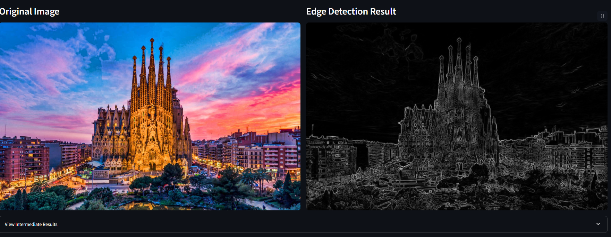
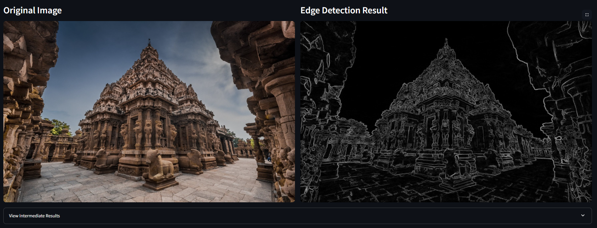
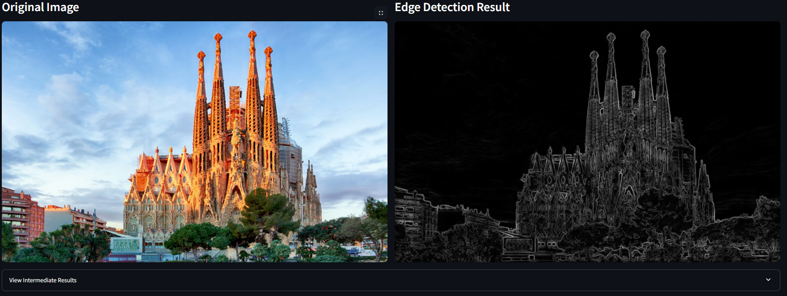
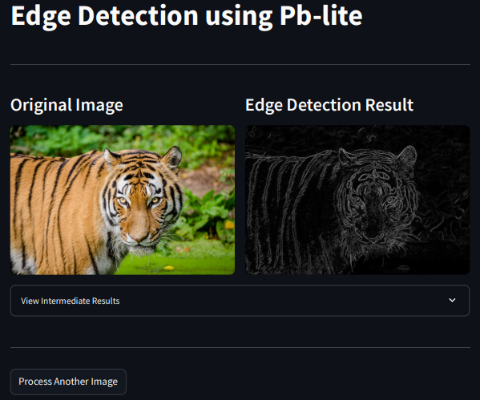
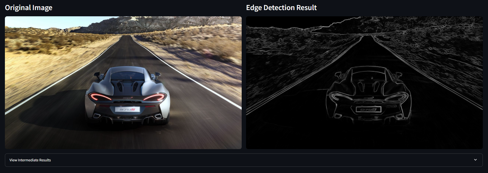
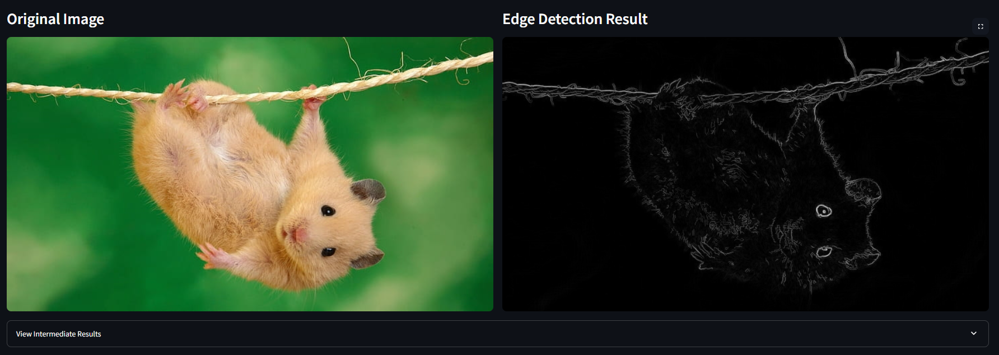

# PB-Lite Algorithm for Edge Detection on Streamlit



## Overview

The **PB-Lite (Probability of Boundary - Lite)** algorithm is an efficient edge detection framework inspired by advanced contour detection techniques. This framework is a simplified version of a recent paper '[Contour Detection and Hierarchical Image Segmentation](https://www2.eecs.berkeley.edu/Research/Projects/CS/vision/grouping/papers/amfm_pami2010.pdf)'. It combines multiple gradient-based and clustering methods to generate accurate edge-detection outputs for images. This simplified version finds boundaries by examining brightness, color, and texture information across multiple scales (different sizes of objects/image). The output of this edge detection framework is a per-pixel probability of boundary. 

We also explore multiple **Deep learning(DL)** architectures--**ResNet, ResNeXt, DenseNet** and a **Custom neural network** to enhance image classification performance. The goal is to evaluate and compare their performance in terms of accuracy, efficiency, and scalability. The project leverages **TensorFlow v1** for training and testing the models, using a custom dataset for classification.

## Features

1. **Pb-lite Edge Detection:**
    - **Filter Banks**: Create three sets of filter banks for filtering images:
        - Leung-Malik (LM) filter bank for textural information
        - Difference of Gaussian (DoG) filter bank for multi-scale edge detection
        - Gabor filter bank for orientation-specific features
    - **Edge Detection**: Combines multiple gradient responses from texture, brightness and color to compute probability of edges with baseline edge-detection methods (Canny, Sobel)
    - **Web Interface**: Interactive web application built with Streamlit for easy image processing
    - **Modular Design**: Allows flexibility for experimentation and fine-tuning


## Methodology

### Pb-lite Edge Detection

1. **Filter Bank Generation**:
    - Leung-Malik filters for textural information
    - Difference of Gaussian filters for multi-scale edge detection
    - Gabor filters for orientation-specific features

2. **Map Creation**:
    - Texture maps using filter bank responses and K-means clustering
    - Brightness and color maps using clustering on pixel intensities

3. **Gradient Computation**:
    - Chi-square gradients using half-disc masks to highlight edges

4. **Edge Detection**:
    - Combine texture, brightness, and color gradients with Sobel and Canny baselines
    - Generate PB-Lite edge-detected outputs using probabilistic methods

## Installation

### Prerequisites

Ensure you have Python 3.8 or later installed. Install additional dependencies listed in the `requirements.txt` file.

### Setup Instructions

1. **Clone this repository**:
   ```bash
   git clone https://github.com/StarkGoku10/Pb_lite_Edgedetection.git
   cd pb_lite_edgedetection
   ```

2. **Create a Virtual Environment (Optional but recommended)**:
   ```bash 
   python3 -m venv venv
   source venv/bin/activate  # on windows: venv\Scripts\activate
   ```

3. **Install dependencies**:
   ```bash
   pip install -r requirements.txt
   ```

### Running the Code

#### Web Application

1. **Start the Streamlit web application**:
   ```bash
   streamlit run app.py
   ```

2. **Using the Web Interface**:
   - Upload an image or provide an image URL
   - Click "Process Image" to run the edge detection
   - View the original image, edge detection result, and intermediate results
   - Use the "Process Another Image" button to try with a different image


## Results

Here are some example results showcasing the edge detection capabilities of our implementation:

| Original Image | Edge Detection Result | Description |
|---------------|----------------------|-------------|
|  |  | Ancient temple architecture with detailed structural edges |
|  |  | Modern architectural elements with complex geometric patterns |
|  |  | Urban landscape with natural and man-made boundaries |
|  |  | Wildlife image demonstrating natural edge detection |
|  |  | Automotive design with smooth curves and sharp edges |
|  |  | Small object with fine details and texture |

The edge detection algorithm successfully identifies:
- Strong structural boundaries in architectural images
- Natural contours in wildlife photography
- Complex geometric patterns in modern architecture
- Fine details in urban landscapes
- Smooth curves and sharp edges in automotive design
- Fine details and textures in small objects

## License 

This project is licensed under the terms of the [MIT License](./LICENSE)

---

